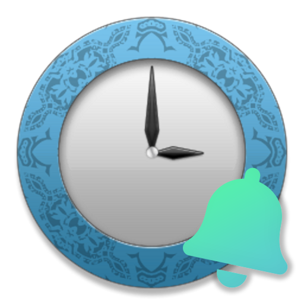

#  EDCBNotifier


**EDCB から LINE・Discord・Twitter に通知を送れるツールです。**

## About・Feature

- LINE (LINE Notify)
- Discord (Discord Webhook)
- Twitter (ツイート)
- Twitter (ダイレクトメッセージ)

に、EDCB からのさまざまな通知を送れるツールです。

[xtne6f 版 EDCB](https://github.com/xtne6f/EDCB) のバッチファイル実行機能を利用しているため、xtne6f 版、または [tkntrec 版](https://github.com/tkntrec/EDCB) などの xtne6f 版をフォークした EDCB が必要です。  
[EDCB Material WebUI](https://github.com/EMWUI/EDCB_Material_WebUI) が使える EDCB をお使いであれば、すぐに使えると思います。  
本家の EDCB に実装されていた Twitter 機能 (Twitter.dll) の代替としても利用できます。

たとえば、**EDCB で録画が開始されたときに番組名を添えて LINE に通知したり、EPG 自動予約で追加された予約を通知で確認することができます。**  
私自身何年も使っていますが、予約や録画状況を通知で確認できるのは地味にかなり便利です。

**LINE へは LINE Notify を使い通知します。**  
LINE Notify は、アプリケーションからの通知を、指定したユーザーやグループに送れるサービスです。  
通知メッセージは LINE Notify の公式アカウントか、任意のグループ LINE で受信できます。一度使ってみたほうが理解しやすいかも。

**Discord へは Discord Webhook を使い通知します。**  
管理者権限を持つサーバーであれば、各テキストチャンネルの設定から簡単に Webhook を設定できます。  
自分用のサーバーを作成して、そこに Webhook を設定してみるのが一番手っ取り早いです。

**Twitter へはツイートでの通知に加え、ダイレクトメッセージでの通知も可能です。**  
ダイレクトメッセージは自分宛てに送ることも、ダイレクトメッセージを送信できる他のアカウントに送ることもできます。  
たとえば、録画通知用の Twitter アカウントとメインのアカウントと相互フォローにして、録画通知用のアカウントからメインアカウント宛てに通知を送ることもできます。

通知できるイベントは、

- **予約を追加したとき** (PostAddReserve.bat が実行されたとき)
- **予約を変更したとき** (PostChgReserve.bat が実行されたとき)
- **録画を開始したとき** (PostRecStart.bat が実行されたとき)
- **録画を終了したとき** (PostRecEnd.bat が実行されたとき)
- **更新通知が送られたとき** (PostNotify.bat が実行されたとき)

の 5 つです。

**それぞれのイベントは、個別に通知するかどうかを設定できます。**  
更新通知が頻繁に送られてきてうるさい、といったときに [更新通知が送られたとき] のイベントだけ通知しないことも可能です。

**通知するメッセージは 5 つのイベントごとに自由に変更できます。**  
EDCB から取得したマクロに加えて、チャンネル名から取得したハッシュタグや更新通知タイプ、チャンネル名や番組名の英数字の半角変換など、独自のマクロも用意しています。  
デフォルトのメッセージでも十分に使えますが、必要に応じてメッセージをカスタムしてみても良いでしょう。

## Migration

EDCBNotifier V2 では、V1 と比較して大幅な改善や変更が行われています。おもな変更点は以下のとおりです。  
いくつか互換性のない変更がありますが、いずれもすぐ移行できる程度のものです。

- **Discord に通知できるようになりました！**
  - Discord Webhook の機能を使い、EDCB からのさまざまな通知を Discord にも送れるようになりました！
  - 管理者権限を持つサーバーであれば、各テキストチャンネルの設定から簡単に Webhook を設定できます。自分用の Discord サーバーに通知させるようにしてみると便利かもしれません。
  - LINE や Twitter への通知と同時に Discord に送信することもできます。
- **EDCBNotifier を実行ファイルにまとめたことで、Python や依存パッケージのインストールが不要になりました！**
  - [Nuitka](https://github.com/Nuitka/Nuitka) という Python プログラムを実行ファイル (.exe) にまとめるツールを使い、EDCBNotifier.exe 単独で通知できるようになりました！
  - これで開発時以外は Python の実行環境や依存パッケージのインストールが不要になり、より導入しやすくなりました。
    - ファイルを配置した後、EpgTimer Service を再起動して設定ファイルを編集するだけで導入できます。
  - ただし、Nuitka 側の問題なのか、残念ながら Windows 7 では EDCBNotifier.exe が正常に動作しません。
    - もし Windows 7 で使いたい方は V1 以前と同じように Python 3.8 の実行環境をインストールし、バッチファイルを適宜書き替える必要があります。Python 3.9 以降は Windows 7 では動作しません。
- **三大都市圏すべてのチャンネルのハッシュタグに対応しました。**
  - チャンネル名のハッシュタグのマクロ (`$ServiceNameHashTag$`) を三大都市圏すべてのチャンネルで使えるようにしました。
  - ほかに対応してほしいチャンネルがあれば、Issue か Pull Request をいただければ実装します。
    - チャンネル名のハッシュタグは [Utils.getServiceNameHashtag()](https://github.com/tsukumijima/EDCBNotifier/blob/master/EDCBNotifier/Utils.py#L150-L242) で定義されています。
- **一部のマクロの名前を変更しました。**
  - `$HashTag$` を `$ServiceNameHashTag$` に、`$HashTagTitle$`　を `$TitleHashTag$` に変更し、他のマクロとの表現の一貫性を高めました。
  - 通知メッセージで上記のマクロをお使いの場合は、マクロの置き換えが必要になります。
- **設定ファイルを config.py から EDCBNotifier.yaml に移行しました。**
  - Python のソースコードで設定内容を記述するのは汎用性が高いとはいえず、記法も比較的複雑で、初心者の方が記法を間違えてエラーになってしまう可能性があったためです。
      - EDCBNotifier の exe 化にあたり、Python コードを exe 化するとほかの .py ファイルを読み込めないという制限があったという事情もあります。
  - YAML は記法のゆれに寛容なほか、JSON ライクに書くこともできて書きやすいため採用しました。
  - これにともない、設定ファイルの書き直しが必要になります。
    - 設定できる内容は V1 とほぼ同じなので、そこまで大変な作業ではないはずです。

### 開発者向け資料

開発時には Python 3.9 と pipenv が必要になりました。  
コードを編集される際は、事前に以下のコマンドを実行し、pipenv の仮想環境を作成しておく必要があります。

```
cd C:\DTV\EDCB\EDCBNotifier
pip install pipenv
$env:PIPENV_VENV_IN_PROJECT = "true"
pipenv sync
```

EDCBNotifier.py の実行をテストする際は、`pipenv shell` で pipenv の仮想環境に入った後、`python EDCBNotifier.py PostAddReserve` のように実行してください。  
`PostAddReserve` の部分はバッチファイルの名前です。直接実行した場合は EDCB から環境変数で渡されるイベントの情報が取得できないため、実行時刻以外の情報がすべて -- になった状態で通知されます。

EDCBNotifier.exe をビルドする場合は、`pipenv run build` を実行してください。  
ビルドには数分～十数分ほど時間がかかります。また、初回は MinGW64 などのダウンロードを求められることがあります。

## Setup

録画後実行 bat に対応する EDCB をお使いであればセットアップは簡単です。  
ファイルを配置して EpgTimerSrv を再起動し、最後に設定ファイルを各自の環境に合わせて編集すれば、あとは放置しておくだけで EDCB からの通知が届きます。

### 1. ダウンロード・配置

[こちら](https://github.com/tsukumijima/EDCBNotifier/releases/download/v2.0.0/EDCBNotifier.zip) のリンクから、EDCBNotifier.zip をダウンロードします。

ダウンロードできたら解凍し、**中に入っているすべてのファイルを EDCB 本体 (EpgTimerSrv.exe) のあるフォルダに配置します。**

EpgTimerSrv.exe のあるフォルダに EDCBNotifier フォルダと PostAddReserve.bat・PostChgReserve.bat・PostRecStart.bat・PostRecEnd.bat・PostNotify.bat が配置されていれば OK です。

> **Warning**  
> **Windows Defender などのウイルス対策ソフトにより、EDCBNotifier.exe がウイルスやマルウェアとしてブロックされてしまう事例が報告されています。**  
> 一般に Python プログラムを exe 化した実行ファイルは、残念ながらウイルスやマルウェアとして誤検知されてしまうことが多いです。  
> EDCBNotifier では、特に誤検知率の高い [PyInstaller](https://pyinstaller.org/en/stable/) の代わりに [Nuitka](https://nuitka.net/) というツールで実行ファイル (.exe) にコンパイルしています。ただ、Nuitka でも完全に誤検知されなくなる訳ではありません。  
> **適宜、ウイルス対策ソフトの保護対象から除外するなどの対応をお願いします。**

### 2. 設定ファイルの作成

EDCB 内に配置した EDCBNotifier フォルダ内の EDCBNotifier.example.yaml は、設定ファイルのひな形になるファイルです。  
**EDCBNotifier.example.yaml を EDCBNotifier.yaml にコピーします。** 事前にコピーしておかないと、設定が読み込めず動きません。

EDCBNotifier.example.yaml 自体をリネームしてもかまいませんが、設定をミスったときのために EDCBNotifier.example.yaml は残しておくことを推奨します。

### 3. EpgTimerSrv の再起動

**バッチファイルの追加を EDCB に反映するためには、EpgTimerSrv (EpgTimer Service) の再起動が必要です。**  

> 事前に、EpgTimer.exe を終了させておいてください。また、録画中や録画が近づいているときは絶対に作業を行わないでください。  

**EpgTimerSrv をタスクトレイに入れて運用している場合は、EpgTimerSrv を一度終了したあと、もう一度起動させてください。**

**EpgTimerSrv を Windows サービス として運用している場合は、EpgTimer Service の再起動が必要です。**

[サービス] アプリから EpgTimer Service を探して、サービスを再起動させてください。  
コマンドプロンプトや PowerShell から `net stop "EpgTimer Service" && net start "EpgTimer Service"` と実行することでも可能です。

> [サービス] アプリは Windows の検索窓に「サービス」と入力すると出てきます。それぞれの項目を右クリックすると各サービスの起動・停止・再起動ができます。

最悪、PC 自体を再起動してしまえば確実に反映されます。どうしても分からない場合は PC を再起動してみてください。  
これでインストールは完了です！

## Usage

**EDCBNotifier の設定は、EDCBNotifier フォルダ内の EDCBNotifier.yaml を編集することで行えます。**  

- LINE への通知は LINE Notify のアクセストークンが必要です。
  - アクセストークンは LINE のアカウントがあればすぐに取得できます。  
- Discord への通知には Discord Webhook の URL が必要です。
  - テキストチャンネルの編集権限に加え、Webhook の作成権限があるサーバーであれば通知できます。
  - EDCBNotifier の通知専用のテキストチャンネルを作っておくと良いでしょう。
- Twitter への通知には Twitter API アプリとのアプリ連携が必要です。
  - V1 では Twitter の開発者登録など手順が煩雑でしたが、デフォルトで設定されているキーを使いアプリ連携をすれば、以前よりも大幅に手順を減らせるようになりました。
  - 今まで通り、各自で用意した Twitter API アプリを使って通知を送ることも可能です。

### 1. 設定

**EDCBNotifier.yaml を編集します。<u>文字コードは UTF-8 (BOM なし)・改行コードは LF で保存してください。</u>**    
できれば VSCode などのシンタックスハイライトのあるエディタでの編集を推奨します。

EDCBNotifier.yaml のコメントにも説明や記述例が記載されていますので、そちらも参考にしてみてください。

**通知タイプ** (notify_type) では、**LINE (LINE Notify)・Discord (Discord Webhook)・Tweet (ツイート)・DirectMessage (ダイレクトメッセージ) から通知先を選択します。**  
デフォルト … 全てに通知する (`['LINE', 'Discord', 'Tweet', 'DirectMessage']`)

**通知を行うイベント** (notify_event) では、**通知するイベントのオン・オフを設定できます。**  
ここで設定したイベントだけが通知されます。設定しなかったイベントは通知されません。  
デフォルト … 全てオン (`['PostAddReserve', 'PostChgReserve', 'PostRecStart', 'PostRecEnd', 'PostNotify']`)

**通知時に同時に送信する画像** (notify_image) では、**通知時に同時に送信する画像を指定できます。**   
`null` に設定した場合は画像を送信しません。画像のファイルサイズが大きすぎると送れない場合があるので注意してください。Discord は 8MB までです。  
デフォルト … 画像を送信しない (`null`)

**番組名に対応するハッシュタグ** (title_hashtag) では、**`$TitleHashTag$` マクロの値に利用する、番組名に対応するハッシュタグを定義します。**  
ここで定義された番組名が `$TitleHankaku$` マクロ (半角の番組名) と部分一致した場合にハッシュタグが利用されます。

**ログをファイルに保存するかどうか** (logging) では、**実行したときのログをファイルに保存するかどうかを設定します。**  
true に設定した場合は、ログを EDCBNotifier.yaml と同じフォルダの EDCBNotifier.log に保存します。前回のログは上書きされます。  
false に設定した場合は、ログを保存せず、代わりに標準出力 (コンソール) に出力します。  
うまく通知されないときは、この設定を true にしてログを確認してみてください。  
デフォルト … ログをファイルに保存する (`true`)

### 2. 通知するメッセージを編集する

通知イベントごとにメッセージを編集できます。  
通知するメッセージの設定は EDCBNotifier.yaml の [メッセージ] セクションにあります。

[EDCB/Document/Readme_EpgTimer.txt](https://github.com/xtne6f/EDCB/blob/work-plus-s-211118/Document/Readme_EpgTimer.txt#L929-L1008) と [EDCB/Document/Readme_Mod.txt](https://github.com/xtne6f/EDCB/blob/work-plus-s-211118/Document/Readme_Mod.txt#L463-L487) に記載されている EDCB のマクロが使えます。  
マクロは `$$` で囲んでください (ex: `$ServiceName$`)。また、配列の要素ごとに改行されます。  
PostRecEnd の `$Drops$` / `$Scrambles$` / `$Result$` など、特定のイベントでのみ利用できるマクロもあります。

また、独自にいくつかのマクロを追加しています。

- `$NotifyName$` … `$NotifyID$` から取得した更新通知タイプ (1: EPGデータ更新, 2: 予約情報更新, 3: 録画結果情報更新)
- `$ServiceNameHashTag$` … チャンネル名から取得したハッシュタグ (ハッシュタグは [Utils.getServiceNameHashtag()](https://github.com/tsukumijima/EDCBNotifier/blob/master/EDCBNotifier/Utils.py#L150-L242) で定義)
- `$TitleHashTag$` … 番組名から取得したハッシュタグ(ハッシュタグは上記の title_hashtag で定義)
- `$ServiceNameHankaku$` … `$ServiceName$` (チャンネル名) の英数字を半角に置換した値
- `$TitleHankaku$` … `$Title$` (番組名) の英数字を半角に置換した値
- `$Title2Hankaku$` … `$Title2$` (番組名から [] で囲まれている部分を削除したもの) の英数字を半角に置換した値
- `$TimeMM$` … 実行時刻の2桁固定の月 (ex: 01 (月)) ・`$TimeM$` … 実行時刻の月 (ex: 1 (月))
- `$TimeDD$` … 実行時刻の2桁固定の日 (ex: 03 (日)) ・`$TimeD$` … 実行時刻の日 (ex: 3 (日))
- `$TimeW$` … 実行時刻の曜日 (ex: 火 (曜日))
- `$TimeHH$` … 実行時刻の2桁固定の時 (24時間) (ex: 09 (時))  `$TimeH$` … 実行時刻の日 (ex: 9 (時))
- `$TimeII$` … 実行時刻の2桁固定の分 (ex: 05 (分)) ・`$TimeI$` … 実行時刻の分 (ex: 5 (分))
- `$TimeSS$` … 実行時刻の2桁固定の秒 (ex: 09 (秒)) ・`$TimeS$` … 実行時刻の分 (ex: 9 (秒))

メッセージは配列形式で記述されています。改行を入れる場合は新しい行に周囲の行と同じフォーマットで記述してください。  
文字列はシングルクオート (`'`) で囲うことを推奨しますが、なくても動くとは思います。  
マクロが存在しないか、マクロの値が空のときは値が -- になります。バッチファイルを直接実行した場合は EDCB から渡される環境変数が取得できないため、全てのマクロの値が -- になります。

デフォルトで設定されているメッセージのように、絵文字も一緒に送信できます。  
ただし、新しい絵文字だと一部のスマホでは表示できないことがあるため注意してください。このほか、絵文字によっては Discord などの背景色と判別しづらい色で表示されてしまう事もあります。

### 3. LINE Notify

LINE Notify へ通知しない場合は必要ありませんが、さほど手間もかかりませんし、一緒にやっておくことをおすすめします。

[LINE Notify](https://notify-bot.line.me/ja/) にアクセスし、右上の [ログイン] から LINE へログインします。いつも使っているアカウントで構いません。  
ログインできたら、右上のメニューから [マイページ] に移動します。


下の方にある「アクセストークンの発行(開発者向け)」へ行き、 [トークンを発行する] をクリックします。


トークン名は LINE Notify で通知が送られてきたときに `[EDCBNotifier] 📢 予約変更:` のように通知の先頭に付加される文字列です。

通知を送信するトークルームは [1:1 で LINE Notify から通知を受ける] か、任意のグループ LINE を選択してください。  
[1:1 で LINE Notify から通知を受ける] は、現在ログインしているアカウントに LINE Notify の公式アカウントから通知が届きます。

ここでは「1:1 で LINE Notify から通知を受ける」を選択します。


 [発行する] をクリックするとアクセストークンが発行されるので、 [コピー] をクリックしてクリップボードにコピーします。  
アクセストークンはこの画面を閉じると二度と表示されないので、どこかにメモしておいてください。

> アクセストークンを同じ設定内容でもう一度発行することはできますが、アクセストークンの値自体は変わってしまいます。


画面を閉じると LINE Notify と設定したトークルームが連携されているはずです。

最後に EDCBNotifier.yaml を開き、**クリップボードにコピーしたアクセストークンを [LINE Notify] セクションの access_token に設定します。**

**これで、LINE Notify に通知を送れるようになりました！**

試しに5つあるバッチファイルのうちのどれかを実行してみましょう。EDCB からの実行ではないためマクロの値は全て -- になっていますが、ちゃんと LINE に通知が届いているはずです。  
もし通知が届かないときは、`EDCBNotifier.log` に何かエラーが出ていないかを確認してみてください。

### 4. Discord (Discord Webhook)

Discord に通知を送信するには、自分がテキストチャンネルを追加・編集できる権限に加え、Webhook（ウェブフック）を管理する権限を持っているサーバーが必要です。一般に、Webhook の管理には管理者のロールが必要だと思います。

ここでは、自分用に作った Discord サーバーに新しく EDCBNotifier 用のテキストチャンネルを作成して、そこに通知を送れるようにしてみます。


EDCBNotifier 用にしたいテキストチャンネルの設定画面を開き、[連携サービス] にある [ウェブフックの作成] をクリックします。


すると Webhook の作成画面に移るので、名前やアイコンを設定します。  
名前やアイコンは EDCBNotifier 側で自動で設定されるため、未設定でも構いません。

終わったら、[ウェブフックURLをコピー] をクリックして、発行された Webhook の URL をクリップボードにコピーします。変更内容を保存するのを忘れずに。 

最後に EDCBNotifier.yaml を開き、**クリップボードにコピーした Webhook の URL を [Discord Webhook] セクションの webhook_url に設定します。**

**これで、Discord に通知を送れるようになりました！**

LINE Notify のように、5つあるバッチファイルのうちのどれかを実行してみましょう。Webhook を設定したチャンネルに EDCBNotifier からの通知が届いていると思います。   
Webhook を設定したチャンネルの通知設定を [すべてのメッセージ] にすると、通知が届いたときに PC やスマホの通知欄にも表示されます。

### 5. Twitter (ツイート・ダイレクトメッセージ)

Twitter にツイートやダイレクトメッセージを送信するには、Consumer Key (API Key) / Consumer Secret (API Secret Key) / Access Token / Access Token Secret の4つのトークンが必要になります。

Consumer Key と Consumer Secret は、Twitter API アプリごとに発行されるものです。  
EDCBNotifier の設定ファイルには、事前に私の方で用意した Twitter API アプリ（ツイートの via に「EDCBNotifier」と表示される）の Comsumer Key / Comsumer Secret が記述されています。

> ご自分で Twitter API の開発者申請を行い、新しく Twitter API アプリを作成して独自の Consumer Key / Consumer Secret を設定することもできます。  
> ご自分で Twitter API アプリを作成される場合は https://tech-blog.rakus.co.jp/entry/20210910/twitter などを参考にしてください。

Access Token と Access Token Secret は、Twitter のアカウントごとに発行されるものです。  
Access Token と Access Token Secret を発行するには、Twitter API アプリとのアプリ連携が必要になります。

アプリ連携の方法はいくつかあります。私が開発した「[Twitter API のアクセストークンを確認するやつ](https://tools.tsukumijima.net/twittertoken-viewer/)」を使うのが手っ取り早いと思いますが、他にも [twhelp](https://github.com/mpyw/twhelp) などのツールでアプリ連携を行えます。

ここでは、デフォルトの Consumer Key / Consumer Secret を使い、「Twitter API のアクセストークンを確認するやつ」でアプリ連携を行う手順を紹介します。  

> 独自の Comsumer Key / Comsumer Secret を使う場合は、事前に Twitter API アプリ設定の [Callback URLs] に `https://tools.tsukumijima.net/twittertoken-viewer/` を設定しておく必要があります。  
> 私の方で用意したデフォルトの Twitter API アプリには事前に設定してあります。


「Twitter API のアクセストークンを確認するやつ」を開き、下のフォームの [コンシューマーキー] に `TuB8ijqybzYRziAc3qHwO3QTx` 、[コンシューマーシークレット] に `6rtWgr8K8r9JJ9gLhy8wPlUVFF6Y4wvYfqyz9Qs6eGm3BixNhl` と入力します。


[認証してアクセストークンを確認する] をクリックすると、Twitter のアプリ連携画面に遷移します。  
[連携アプリを認証] をクリックして、アプリ連携を許可してください。


アプリ連携を許可すると [アクセストークン] と [アクセストークンシークレット] が表示されるので、それぞれクリップボードにコピーしてください。

最後に EDCBNotifier.yaml を開き、**クリップボードにコピーした Access Token・Access Token Secret を [Twitter API] セクションの access_token・access_token_secret にそれぞれ設定します。**

また、**ダイレクトメッセージの送信先のアカウント** (direct_message_destination) では、**ダイレクトメッセージで通知を送るアカウントを、アカウントの ID (スクリーンネーム) で指定できます。**  
@ 自体はつけずに記述してください。事前に送信先のアカウントにダイレクトメッセージが送信できる状態になっていないと、送信に失敗します。  
`null` に設定すると、ダイレクトメッセージを通知を送信するアカウント自身に送信します。  
デフォルト … 自分宛てに送信する (`null`)

**これで、Twitter にツイートやダイレクトメッセージで通知を送れるようになりました！**

LINE Notify や Discord と同じように、5つあるバッチファイルのうちのどれかを実行してみましょう。  
EDCBNotifier からの通知がツイートされていて、自分宛てに通知のダイレクトメッセージが届いていれば OK です。

-----

これで設定は完了です！お疲れさまでした！   
なにか不具合や要望などあれば [Issues](https://github.com/tsukumijima/EDCBNotifier/issues) か [Twitter](https://twitter.com/TVRemotePlus) までお願いします。 

## License
[MIT License](LICENSE.txt)
